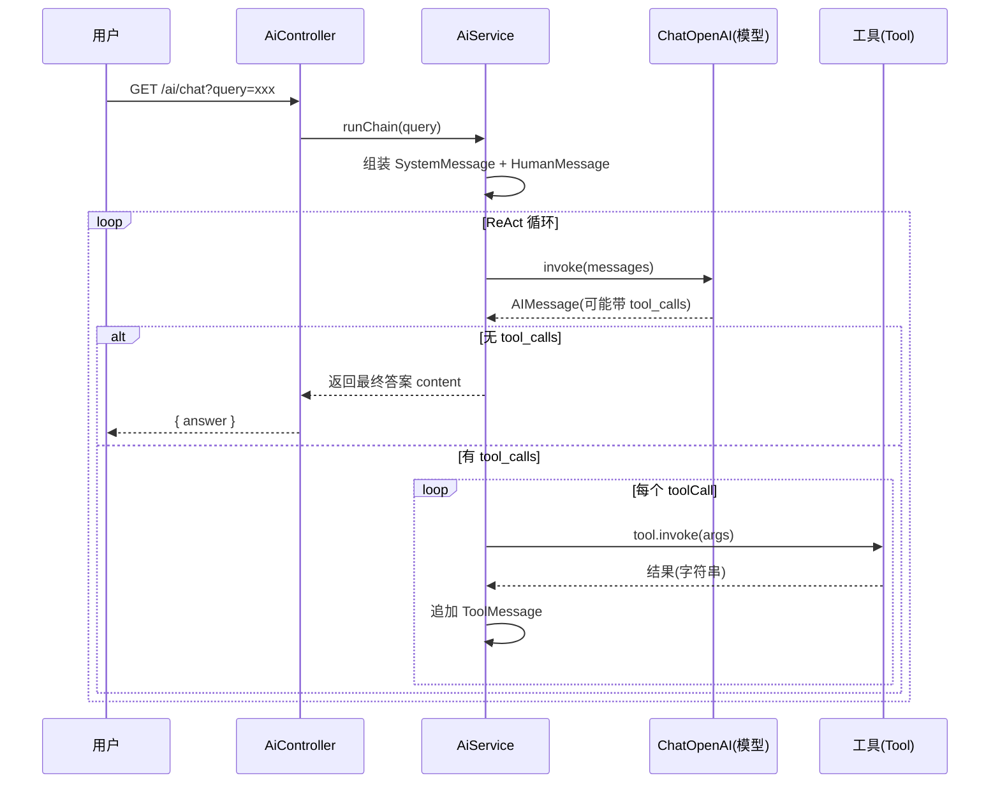
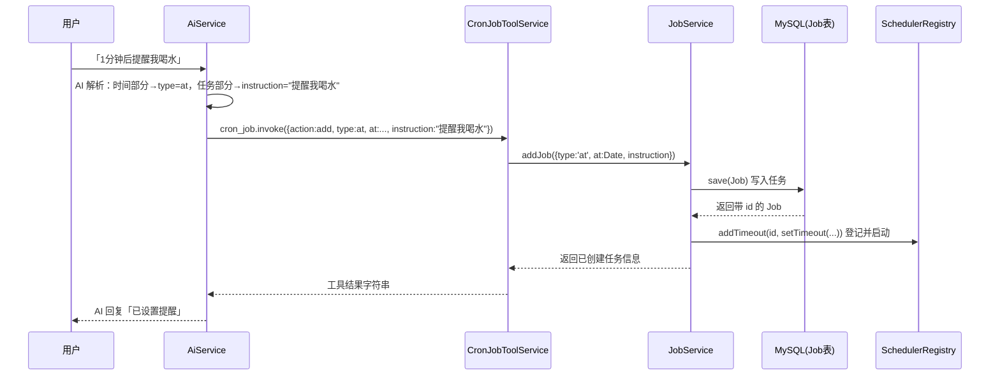
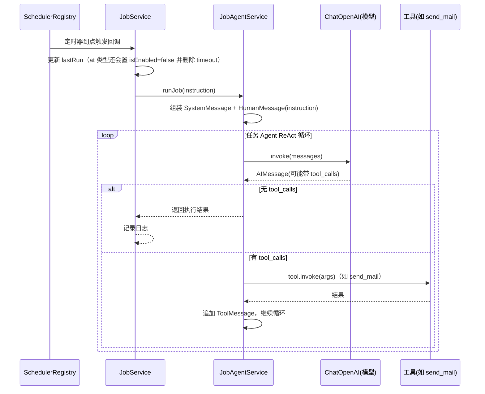

# cron-job-tool

基于 **NestJS + LangChain** 的 AI 定时任务管理系统。用户可以用自然语言和 AI 对话，让 AI 自动调用工具完成查用户、发邮件、网络搜索、读写数据库，以及**创建和管理定时/周期任务**；任务到点后由后台 Agent 自动执行。

一句话理解它：**一个「能听懂人话、会自己规划步骤、还会在指定时间自己干活」的 AI Agent 服务**。

---

## 技术栈

| 类别 | 技术 |
|------|------|
| 后端框架 | NestJS 11 + TypeScript |
| AI 框架 | LangChain（`@langchain/core` + `@langchain/openai`） |
| 数据库 | TypeORM + MySQL（`mysql2`） |
| 定时调度 | `@nestjs/schedule`（`SchedulerRegistry`）+ `cron` + 原生 `setInterval`/`setTimeout` |
| 邮件 | `@nestjs-modules/mailer` + nodemailer |
| 网络搜索 | Bocha Web Search API |
| 参数校验 | zod（工具参数）+ class-validator（DTO） |
| 接口文档 | `@nestjs/swagger` |

---

## 目录结构

```
cron-job-tool/src/
├── main.ts                        # 应用入口（bootstrap）
├── app.module.ts                  # 根模块：集中注册 Config/TypeORM/Mailer/Schedule 等
├── app.controller.ts / app.service.ts   # 根路由（GET / → Hello World）
├── generate-openapi.ts            # 独立脚本：生成 openapi.json
│
├── ai/                            # AI 对话模块
│   ├── ai.module.ts               # 注册 AiService + UserService + 内联工具 query_user
│   ├── ai.controller.ts           # GET /ai/chat（普通）、GET /ai/chat/stream（SSE 流式）
│   ├── ai.service.ts              # 对话 Agent：ReAct 循环（绑定 6 个工具）
│   ├── job-agent.service.ts       # 任务 Agent：后台执行 instruction（绑定 4 个工具）
│   └── user.service.ts            # 内存版用户数据（Map，6 个三国预设用户）
│
├── tool/                          # 工具模块（LangChain Tool 集中创建/导出）
│   ├── tool.module.ts             # 用字符串 token 导出 CHAT_MODEL + 5 个工具
│   ├── llm.service.ts             # 从 .env 创建 ChatOpenAI 模型实例
│   ├── send-mail-tool.service.ts  # send_mail 工具
│   ├── web-search-tool.service.ts # web_search 工具（Bocha API）
│   ├── db-users-crud-tool.service.ts # db_users_crud 工具（users 表 CRUD）
│   ├── time-now-tool.service.ts   # time_now 工具
│   └── cron-job-tool.service.ts   # cron_job 工具（list/add/toggle）
│
├── job/                           # 定时任务模块
│   ├── job.module.ts
│   ├── job.service.ts             # 任务增删改查 + 底层调度注册/触发
│   └── entities/job.entity.ts     # Job 实体（映射 jobs 表）
│
└── users/                         # 用户 REST 模块
    ├── users.controller.ts        # /users CRUD REST API
    ├── users.service.ts           # TypeORM 操作 MySQL users 表
    ├── users.module.ts
    ├── entities/user.entity.ts    # User 实体
    └── dto/                       # create-user.dto / update-user.dto
```

---

## 核心概念

### 1. Agent（智能体）

本项目有两个**独立的 AI Agent**，它们绑定不同的工具集合，职责不同：

| Agent | 所在服务 | 面向对象 | 绑定工具 | 作用 |
|-------|---------|---------|---------|------|
| 对话 Agent | `AiService` | 用户 | 6 个（含 `query_user`、`cron_job`） | 聊天、规划步骤、创建定时任务 |
| 任务 Agent | `JobAgentService` | 系统 | 4 个（**不含** `query_user`、`cron_job`） | 到点后执行 instruction |

任务 Agent 刻意**不绑定 `cron_job`**，是为了防止「定时任务里再创建定时任务」造成无限递归；**不绑定 `query_user`** 是因为那是内存演示数据，后台任务应以数据库为准。

### 2. 工具（Tool）

「工具」不是普通工具类，而是把一段函数包装成 **AI 可以自己决定何时调用的能力**。每个工具由三部分组成：

```
tool(fn, { name, description, schema })
       │       │        │        └─ zod 定义的参数结构
       │       │        └─ 给 AI 看的名字（AI 靠它「点名」调用）
       │       └─ 给 AI 看的功能描述（AI 靠它判断该不该用）
       └─ 工具真正执行的函数
```

AI 通过读取 `name` + `description` + `schema` 来决定「要不要调、传什么参数」。

### 3. ReAct 循环

两个 Agent 的核心都是 **ReAct（Reasoning + Acting）循环**：`思考 → 决定调用工具 → 执行工具 → 观察结果 → 再思考 → …` 直到 AI 认为可以直接回答/任务完成。

### 4. 定时任务三种类型

| 数据库 type | 底层实现 | 典型场景 |
|------------|---------|---------|
| `cron` | `cron` 包的 `CronJob`（6 段表达式，带秒） | 每天 8:00 发日报 |
| `every` | JS `setInterval`（`everyMs` 毫秒） | 每 30 秒查一次状态 |
| `at` | JS `setTimeout`（目标时间 `at`） | 10 分钟后发提醒（执行一次后自动停用） |

---

## 工具清单

| 工具名 | 功能 | 所属服务 | 底层实现 | 对话 Agent | 任务 Agent |
|--------|------|---------|---------|:---:|:---:|
| `query_user` | 查询内存用户 | `AiModule` 内联工厂 + `UserService`(内存) | 内存 Map（6 个三国用户） | ✅ | ❌ |
| `send_mail` | 发送邮件 | `SendMailToolService` | `MailerService`/nodemailer | ✅ | ✅ |
| `web_search` | 互联网搜索 | `WebSearchToolService` | Bocha Web Search API | ✅ | ✅ |
| `db_users_crud` | users 表增删改查 | `DbUsersCrudToolService` | `UsersService`/TypeORM | ✅ | ✅ |
| `time_now` | 获取服务器时间 | `TimeNowToolService` | JS `Date` | ✅ | ✅ |
| `cron_job` | 定时任务 `list`/`add`/`toggle` | `CronJobToolService` | `JobService` | ✅ | ❌ |

> 工具通过 `ToolModule` 以**字符串 token**（如 `'SEND_MAIL_TOOL'`）导出，`AiModule`/`JobModule` 用 `@Inject('XXX_TOOL')` 注入。

---

## 调用流程

### 流程一：普通 AI 对话（ReAct 循环）

```
用户 → GET /ai/chat?query=xxx
     → AiController.chat()
     → AiService.runChain(query)
```



关键点：AI 可能一次返回多个 `tool_calls`，会逐个执行并把结果作为 `ToolMessage` 追加进消息列表，再回到下一轮 `invoke`，直到 AI 不再调用工具、输出最终回答为止。

### 流程二：流式对话（SSE）

```
用户 → GET /ai/chat/stream?query=xxx
     → AiController.chatStream()
     → AiService.runChainStream(query)  [async generator]
     → from(stream).pipe(map(...)) → SSE 逐块推送
```

- `runChainStream` 是 `async *` 生成器，内部用 `modelWithTools.stream()` 逐块 `yield` 文本；
- `AiController` 用 RxJS `from(stream)` 包装成 `Observable<MessageEvent>`，NestJS 的 `@Sse()` 自动按 SSE 格式推给前端；
- 一旦检测到 `tool_call_chunks`（要调工具了）就停止输出文本，静默执行工具后再进入下一轮。

### 流程三：创建定时任务

```
用户说「1分钟后提醒我喝水」
  → runChain → AI 决定调用 cron_job 工具（type=at）
  → CronJobToolService → JobService.addJob(...)
  → ①写库 jobs 表  ②startRuntime() 登记到 SchedulerRegistry
```



> 注意：System Prompt 里有一条重要规则——「未来某个时间执行的动作」本轮只负责用 `cron_job` **登记任务**，不要在当前轮真的执行它（例如不要立刻 `send_mail`）。`instruction` 只填「要做什么」的自然语言，交给将来的任务 Agent 去跑。

### 流程四：定时任务到点执行

```
调度器触发（CronJob / setInterval / setTimeout）
  → JobService 回调
  → 更新 lastRun
  → JobAgentService.runJob(instruction)
  → 任务 Agent 自己的 ReAct 循环（4 个工具）
  → 完成实际动作（如 send_mail）
```



### 启动恢复（OnApplicationBootstrap）

应用启动完成后，`JobService.onApplicationBootstrap()` 会从数据库捞出所有 `isEnabled=true` 的任务，重新登记到 `SchedulerRegistry`，**保证服务重启后定时任务不丢失**。

---

## 环境变量

复制 `.env.example` 为 `.env` 并填写：

```ini
# ── MySQL 数据库 ──
DB_TYPE=mysql
DB_HOST=192.168.174.128
DB_PORT=3306
DB_USERNAME=root
DB_PASSWORD=123456
DB_DATABASE=hello
DB_SYNCHRONIZE=true          # 开发环境自动同步表结构
DB_LOGGING=true
DB_CONNECTOR=mysql2

# ── 大模型（OpenAI 兼容端点）──
OPENAI_API_KEY=sk-xx
OPENAI_BASE_URL=https://api.deepseek.com/v1
MODEL_NAME=deepseek-chat

# ── 邮件 SMTP ──
MAIL_HOST=smtp.qq.com
MAIL_PORT=587                  # 587=STARTTLS(secure:false)；465=SSL(secure:true)
MAIL_SECURE=false
MAIL_USER=xx@xx.com
MAIL_PASS=xx
MAIL_FROM="No Reply" <xx@xx.com>

# ── Bocha 网络搜索 ──
BOCHA_API_KEY=sk-xx
```

> ⚠️ 若发邮件报 `connect ETIMEDOUT 198.18.0.4:587`，是代理软件（Clash/Surge 等）的 TUN/fake-ip 模式拦截了 SMTP 流量，与代码无关。解决：代理里给 `qq.com` 加 `DIRECT` 直连规则，或关闭 TUN 模式。

---

## 运行命令

### 安装依赖

```bash
$ npm install
```

### 编译并运行

```bash
# 开发模式
$ npm run start

# watch 模式（热重载）
$ npm run start:dev

# 生产模式
$ npm run start:prod
```

### 运行测试

```bash
# 单元测试
$ npm run test

# e2e 测试
$ npm run test:e2e

# 测试覆盖率
$ npm run test:cov
```

---

## 接口速查

| 方法 | 路径 | 说明 |
|------|------|------|
| GET | `/` | Hello World（探活） |
| GET | `/ai/chat?query=xxx` | 普通 AI 对话（一次性返回） |
| GET | `/ai/chat/stream?query=xxx` | 流式 AI 对话（SSE） |
| POST | `/users` | 创建用户 |
| GET | `/users` | 用户列表 |
| GET | `/users/:id` | 单个用户 |
| PATCH | `/users/:id` | 更新用户 |
| DELETE | `/users/:id` | 删除用户 |

> 项目未在运行时启用 Swagger UI，而是通过脚本生成静态接口文档（需本地 MySQL 可用）：

```bash
$ npx ts-node src/generate-openapi.ts   # 在项目根目录生成 openapi.json
```
